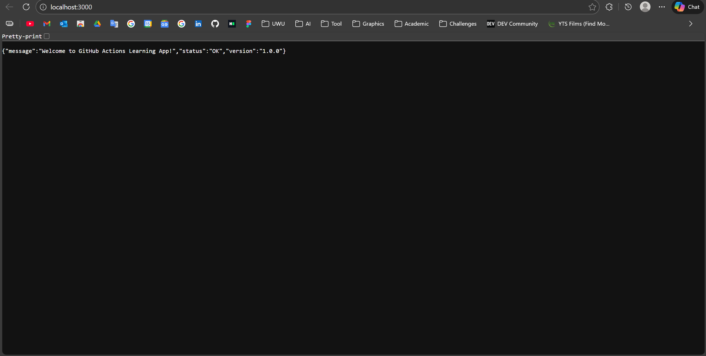
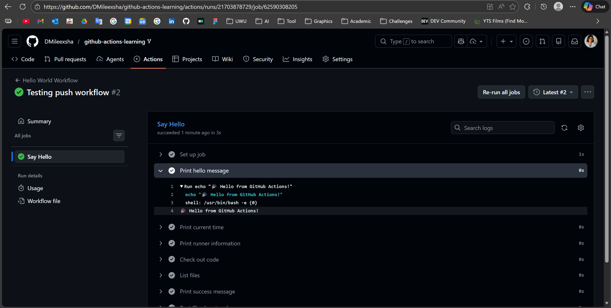

# Beginner Task Submission - Mileesha

### 1. Workflow Run Evidence

### 2. Localhost Verification

### 3. Test Results

### 4. Push Event

---
### Task Checklist
- [x] Forked the repo
- [x] Completed Beginner tasks
- [x] Uploaded screenshots
- [x] Localy Tsted
